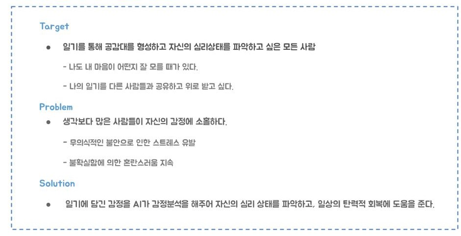
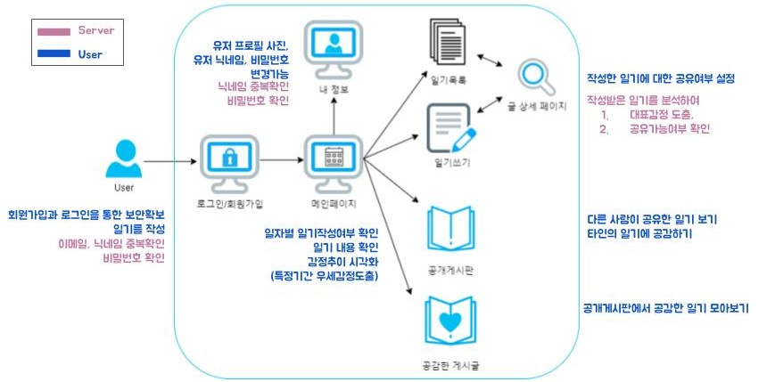

  

  

   

  <h4>"행복은 두 배로, 슬픔은 반으로"</h4>

  
<!-- 

 

 -->

## 1. 프로젝트 소개

0.  기능 소개

    - 사용자가 일기를 쓰면 내용을 분석하여 알맞은 감정을 자동으로 라벨링 
    - 일자별 감정추이를 시각화한 캘린더와 그래프 제공 
    - 다른사람이 공유한 일기를 읽고 공감할 수 있는 '공감'버튼

     

1.  Used DataSets

    - [AI허브 : "한국어 감정 정보가 포함된 단발성 대화 데이터셋"](https://aihub.or.kr/opendata/keti-data/recognition-laguage/KETI-02-009) 
    - [비속어데이터셋1](https://github.com/kocohub/korean-hate-speech) 
    - [비속어데이터셋2](https://github.com/kocohub/korean-hate-speech)

     

2.  Environment
    <table>
      <tr>
        <td></td>
        <td></td>
        <td></td>
        <td></td>
        <td></td>
        <td></td>
        <td></td>
      </tr>
      <tr>
        <td align=center>Javascript</td>
        <td align=center>JSX</td>
        <td align=center>Python 3.8 </td>
        <td align=center>Flask</td>
        <td align=center>mySQL</td>
        <td align=center>SQL Alchemy</td>
        <td align=center>Ngnix</td>
      </tr>
    </table>

    > , 

      

3.  Library
    <table>
      <tr>
        <td></td>
        <td></td>
        <td></td>
        <td></td>
        
        
      </tr>
      <tr>
        <td align=center>Pytorch</td>
        <td align=center>React</td>
        <td align=center>Axios</td>
        <td align=center>Recoil</td>

      </tr>
    </table>

    > , ,
    > , , , , , , , ,

    

        
Details

        alembic==1.7.5
        certifi==2019.11.28
        chardet==3.0.4
        click==8.0.3
        Cython==0.29.25
        dbus-python==1.2.16
        distro-info===0.23ubuntu1
        filelock==3.4.0
        Flask==2.0.2
        Flask-Cors==3.0.10
        Flask-Migrate==3.1.0
        Flask-SQLAlchemy==2.5.1
        flatbuffers==2.0
        gluonnlp==0.10.0
        graphviz==0.8.4
        greenlet==1.1.2
        huggingface-hub==0.2.1
        idna==2.8
        importlib-metadata==4.8.2
        importlib-resources==5.4.0
        itsdangerous==2.0.1
        Jinja2==3.0.3
        joblib==1.1.0
        kobert @ git+https://github.com/SKTBrain/KoBERT.git@77466ab67f2700f7aad3ae59c31b888eebd9e509
        Mako==1.1.6
        MarkupSafe==2.0.1
        mxnet==1.8.0.post0
        numpy==1.21.4
        onnxruntime==1.10.0
        packaging==21.3
        pandas==1.3.4
        protobuf==3.19.1
        PyGObject==3.36.0
        PyMySQL==1.0.2
        pyparsing==3.0.6
        python-apt==2.0.0+ubuntu0.20.4.6
        python-dateutil==2.8.2
        pytz==2021.3
        PyYAML==6.0
        regex==2021.11.10
        requests==2.22.0
        requests-unixsocket==0.2.0
        sacremoses==0.0.46
        sentencepiece==0.1.96
        six==1.14.0
        SQLAlchemy==1.4.28
        tokenizers==0.8.1rc1
        torch==1.10.0
        tqdm==4.62.3
        transformers==3.0.2
        typing_extensions==4.0.1
        unattended-upgrades==0.1
        urllib3==1.25.8
        Werkzeug==2.0.2
        zipp==3.6.0

    

     

4.  Skills
    <table>
      <tr>
        <td></td>
        <td></td>
        
      </tr>
      <tr>
        <td align=center>KoBERT 2.0</td>
        <td align=center>NVIDIA CUDA</td>

      </tr>
    </table>

    > , 

     
        

## 2. 프로젝트 목표

   

   

## 3. 프로젝트 기능 설명

   

   

## 4. 프로젝트 구성도

- [와이어프레임](https://www.figma.com/file/fVKhM58EkIDBi7BJebwkBp/MOODMOOD?node-id=0%3A1)
- [스토리보드](https://docs.google.com/presentation/d/1DTDAZEgTwaf5CVYe-uQtZbqBPVOKa0wAzedMZz1HV6s/edit?usp=sharing)

     

## 5. 프로젝트 팀원 역할 분담

| Name   | Position   | Role                                                                 |
| ------ | ---------- | -------------------------------------------------------------------- |
| 남정윤 | AI, Leader | 프로젝트 기획  AI 모델구축   일일 회의록 작성   Readme 작성 |
| 권순빈 | AI         | 데이터셋 전처리  AI 모델구축   발표자료 정리                   |
| 박소현 | Frontend   | 프론트엔드 개발                                                      |
| 신호연 | Backend    | 백엔드 설계 & 개발   DB 작업   배포 작업 & 서버 관리           |
| 문성권 | Backend    | 백엔드 개발   API 작업   AI Serving                            |

   

## 6. 버전

- v1.2.0

   

## 7. FAQ

- 자주 받는 질문 정리
